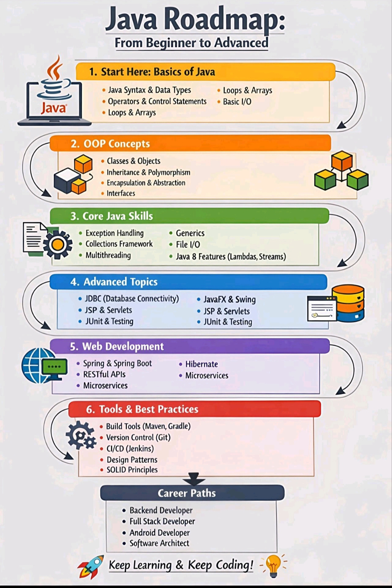

## Frontend, Java Backend, and Computer Science fundamentals.

## 📂 Contents of This Repository

### 🌐 Frontend Technologies
- HTML
- CSS
- Bootstrap
- JavaScript
- React
- Git & GitHub

---

### ☕ Java & Backend Development

- Core Java Programming
- Java Notes (OOPs, Collections, JDBC, Multithreading, etc.)
- Spring Framework
- Spring MVC
- Spring Boot
- REST API
- Microservices

---

### 🧠 Computer Science Subjects
- DBMS
- SQL
- Operating System
- Computer Networks
- TOC

---

### 📌 Note
This repository is continuously updated with new content and improvements.

Happy Learning! 
## 🌐 Frontend Technologies (Order Wise)

 1️⃣ HTML   https://github.com/kRamu81/Notes/tree/main/HTML  

2️⃣ CSS  
 https://github.com/kRamu81/Notes/tree/main/CSS  

 3️⃣ Bootstrap   https://github.com/kRamu81/Notes/tree/main/Bootstrap  

 4️⃣ JavaScript   https://github.com/kRamu81/Notes/tree/main/Javascript  

5️⃣ Git & GitHub   https://github.com/kRamu81/Notes/tree/main/Git%26GitHub  

6️⃣ React   https://github.com/kRamu81/Notes/tree/main/React  

## Database (Order Wise)

 SQL 
https://github.com/kRamu81/Notes/tree/main/SQL 

## ☕ Java Notes (Order Wise)

 Java   https://github.com/kRamu81/Notes/tree/main/Java%20Notes/java 

 OOPs   https://github.com/kRamu81/Notes/tree/main/Java%20Notes/Oops  

 Exception Handling   https://github.com/kRamu81/Notes/tree/main/Java%20Notes/Exception%20Handling  

  Java Collection Framework   https://github.com/kRamu81/Notes/tree/main/Java%20Notes/Java%20Collection%20framework  

 Multi Threading   https://github.com/kRamu81/Notes/tree/main/Java%20Notes/Multi%20Threading  

 File Handling   https://github.com/kRamu81/Notes/tree/main/Java%20Notes/File%20Handling  

JDBC   https://github.com/kRamu81/Notes/tree/main/Java%20Notes/JDBC  

 Servlet & JSP  
 https://github.com/kRamu81/Notes/tree/main/Java%20Notes/Servlet%20%26%20Jsp  

MVC (Concept)   https://github.com/kRamu81/Notes/tree/main/Java%20Notes/MVC  

Spring Framework   https://github.com/kRamu81/Notes/tree/main/Java%20Notes/Spring%20Framework  

Spring MVC   https://github.com/kRamu81/Notes/tree/main/Java%20Notes/Spring%20MVC  

 REST API   https://github.com/kRamu81/Notes/tree/main/Java%20Notes/Rest%20API  

 Spring Boot   https://github.com/kRamu81/Notes/tree/main/Java%20Notes/Spring%20boot  

 Microservices   https://github.com/kRamu81/Notes/tree/main/Java%20Notes/Microservices
